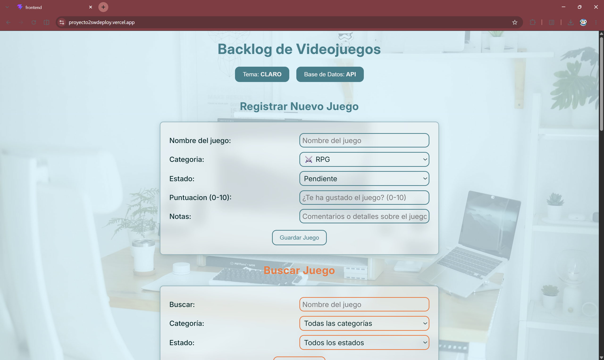
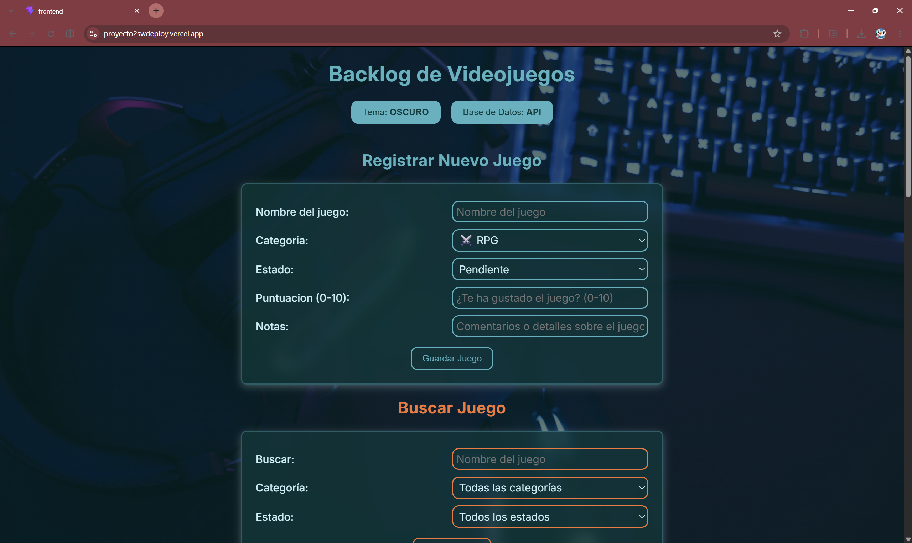
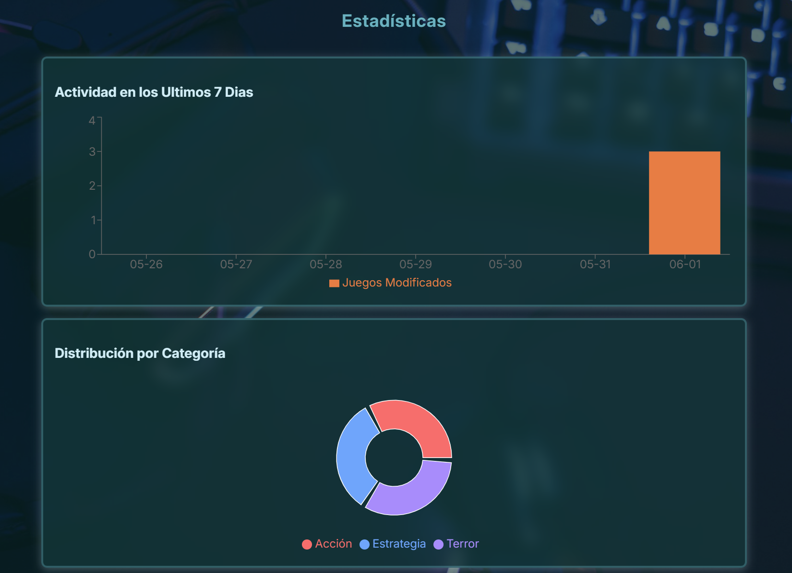
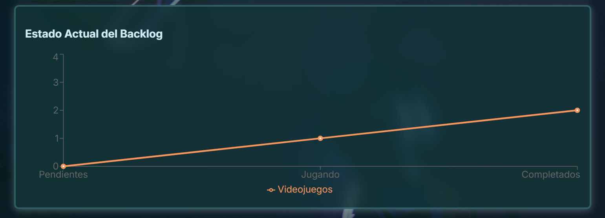
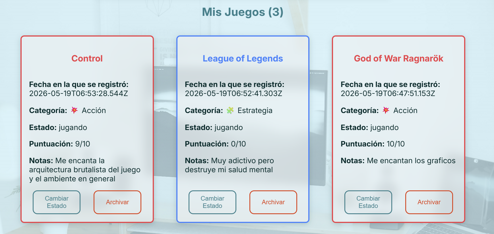
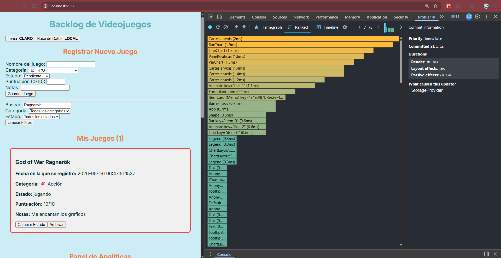
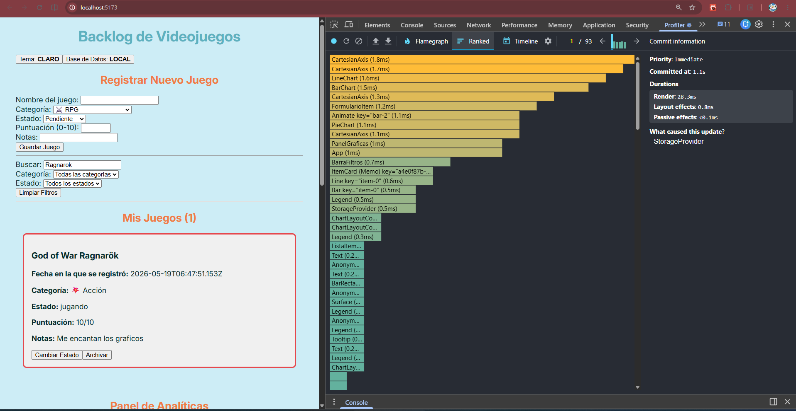

# Backlog de Videojuegos

El propósito de esta aplicación es poder gestionar tu biblioteca de juegos y obtener estadísticas acerca de ella.

*   **URL Demo en Vercel (Frontend):** https://proyecto2swdeploy.vercel.app/
*   **URL Pública en Render (Backend):** https://proyecto2sw.onrender.com
(la ruta que se utiliza para obtener los juegos es /api/items) 
## Capturas de Pantalla de la Aplicación

### Interfaz en Modo Claro


### Interfaz en Modo Oscuro


### Panel de Estadísticas


**Mi Gráfica Original**:
Hice un gráfico de líneas que muestra el Estado Actual del Backlog. El gráfico te muestra si tu backlog está siendo jugado realmente. Por ejemplo, si Pendientes está muy arriba de Completados, es necesario empezar a jugar antes de comprar más juegos.



## Tecnologías Utilizadas

| Tecnología | Rol | Versión Utilizada |
| :--- | :--- | :--- |
| **React** | Biblioteca para crear interfaz | v19.2.6 |
| **Vite** | Herramienta para compilar el frontend | v8.0.12 |
| **Express** | Framework para crear el servidor del backend HTTP | v5.2.1 |
| **SQLite3** | Base de datos relacional ligera | v6.0.1 |
| **Recharts** | Visualización de datos en SVG | v2.15.4 |
| **Vercel** | Plataforma de hosting y deploy Frontend | Preset de Vite/Environment de Production/Tier de Hobby (Gratis) |
| **Render** | Plataforma de hosting y deploy Backend | Free/0.1 CPU/512 MB |

## Cómo Correr el Proyecto

### 1) Clonar el repositorio

Clona el repositorio y luego navega hacia la carpeta:

```bash
git clone https://github.com/yosemm/Proyecto2SW.git
cd Proyecto2SW
```

### 2) Levantar el backend (Express + SQLite)

En una terminal, ejecuta los comandos para iniciar el servidor local:

```bash
cd backend
npm install
node src/index.js
```

Link del backend local: http://localhost:3000

La base de datos SQLite se crea automáticamente al encenderse el servidor.

### 3) Levantar el frontend (React + Vite)

En otra terminal, inicia el frontend de React con Vite:

```bash
cd frontend
npm install
npm run dev
```

Frontend local: http://localhost:5173

### 4) Conectar frontend con backend

El frontend usa `http://localhost:3000` por defecto.

Para definir el link manualmente, crea el archivo `frontend/.env` con:

```env
VITE_API_URL=http://localhost:3000
```

### 5) Prueba de funcionamiento

1. Abre el frontend en el navegador.
2. Cambia al modo **API**.
3. Agrega un juego desde el formulario.
4. Verifica que el juego aparezca en la lista.
5. Recarga la página y verifica que persisten los datos.

## Mis Primeros Items


Para validar el funcionamiento de la inserción de datos, se agregaron los siguientes juegos:

#### 1. Control (2019)

- **Categoría:** 💥 Acción
- **Estado:** Completado
- **Puntuación:** 10/10

Me encanta la arquitectura brutalista del juego y el ambiente en general.

#### 2. League of Legends

- **Categoría:** 🧩 Estrategia
- **Estado:** Jugando
- **Puntuación:** 6/10

Muy adictivo, pero destruye mi salud mental.

#### 3. Resident Evil Village

- **Categoría:** 👻 Terror
- **Estado:** Completado
- **Puntuación:** 8/10

Me encantó que los enemigos fueran más de fantasía, especialmente Miranda.

## Mi Paleta de Colores 
Mi paleta se basó en juntar tonos de azul y naranja, ya que son complementarios. 
### Tema Claro
* `--color-bg` (`#CDEDF6`): Fondo principal celeste claro y suave para que la interfaz se sienta ligera.
* `--color-text` (`#042A2B`): Color de texto azul oscuro para buena legibilidad.
* `--color-primary` (`#3E7E89`): Color turquesa principal de la app.
* `--color-card-bg` (`#f0f0f0`): Fondo blanco/gris de las tarjetas para separarlas del resto.
* `--color-accent` (`#EF7B45`): Color naranja de énfasis para contrastar con el color primario.
* `--color-accent-dark` (`#D84727`): Variante más fuerte para acciones como archivar.

### Tema Oscuro
* `--color-bg` (`#042A2B`): Fondo principal turquesa oscuro.
* `--color-text` (`#CDEDF6`): Texto turquesa claro para mantener el contraste y que sea fácil leer.
* `--color-primary` (`#6db9c7`): Color turquesa un poco más claro, principal de la app.
* `--color-card-bg` (`#0b3d3e`): Fondo turquesa oscuro pero ligeramente más claro que el color del fondo para las tarjetas.
* `--color-accent` (`#EF7B45`): Color naranja de énfasis para contrastar con el color primario.
* `--color-accent-dark` (`#ff935c`): Variante más fuerte para acciones como archivar.

### Categorías

Los colores de las categorias se implementan en los bordes y en los títulos de las tarjetas.

**Modo claro**

* `--categoria-rpg`: `#7C5CFC`
* `--categoria-accion`: `#E5484D`
* `--categoria-estrategia`: `#3B82F6`
* `--categoria-terror`: `#8B5CF6`
* `--categoria-deportes`: `#10B981`

**Modo oscuro**

* `--categoria-rpg`: `#9B7CFF`
* `--categoria-accion`: `#FF6B6B`
* `--categoria-estrategia`: `#60A5FA`
* `--categoria-terror`: `#A78BFA`
* `--categoria-deportes`: `#34D399`

## Gráficas y Decisiones Técnicas

### Gráfica Original: Estado Actual del Backlog

Esta gráfica muestra cuántos juegos se encuentran en cada estado: pendiente, jugando y completado.

La idea detrás de esta visualización es tener una referencia rápida de cómo va evolucionando el backlog de videojuegos. Si la cantidad de juegos pendientes comienza a crecer demasiado en comparación con la de juegos completados, en la gráfica se vuelve muy notable. También funciona como un recordatorio visual de que hay juegos pendientes por completar.

### Decisiones Técnicas

#### Reducer centralizado

La aplicación utiliza un reducer principal para administrar las acciones relacionadas con los videojuegos. Se procuró mantener separadas las acciones que modifican datos reales de aquellas que únicamente afectan la interfaz.

Por ejemplo, acciones como agregar un juego o cambiar su estado afectan directamente la información almacenada, mientras que otras acciones como actualizar una búsqueda solo modifican información temporal utilizada por la interfaz.

#### Manejo de fechas fuera del reducer

Para mantener el reducer lo más simple y predecible posible, se evitó generar fechas dentro de él. Los timestamps se generan desde los componentes y posteriormente se envían dentro de la acción correspondiente.

De esta manera, el reducer recibe toda la información necesaria y se limita a procesarla sin depender de elementos externos.

#### Procesamiento de fechas para las gráficas

La gráfica de actividad de los últimos siete días se genera agrupando los registros según la fecha en la que fueron creados. Para ello se construye un arreglo con los últimos siete días y posteriormente se contabilizan los elementos que pertenecen a cada fecha.

Este enfoque permite generar la información necesaria para la visualización sin almacenar estructuras adicionales dentro del estado global.


## Rendimiento y Análisis con React Profiler

Para evaluar el comportamiento de la aplicación se utilizó React Profiler mientras se realizaban búsquedas rápidas dentro de la lista de juegos.

### Evidencia

* Análisis antes de optimizar: 

* Análisis después de optimizar: 

### Resultados

Al revisar las métricas se observó que los componentes de Recharts representan la mayor parte del tiempo de renderizado debido a la generación de SVG para las gráficas.

Antes de estas optimizaciones, el tiempo total de renderizado fue de **30.7 ms**. Después de utilizar `React.memo` y `useCallback`, el tiempo disminuyó a **28.3 ms**.

Aunque la diferencia no es extremadamente grande, se redujó el trabajo realizado durante cada actualización del estado.


## Custom Hooks Implementados

Todos los hooks fueron documentados utilizando JSDoc dentro del directorio `src/hooks`.

| Hook                | Archivo                | Descripción                                                                                                       |
| ------------------- | ---------------------- | ----------------------------------------------------------------------------------------------------------------- |
| `useLocalStorage`   | `useLocalStorage.js`   | Sincroniza automáticamente un estado de React con `localStorage`.                                                 |
| `useFetch`          | `useFetch.js`          | Realiza peticiones GET e incorpora un `AbortController` para cancelar solicitudes pendientes cuando es necesario. |
| `useAtajoTeclado`   | `useAtajoTeclado.js`   | Registra atajos de teclado globales y realiza la limpieza cuando se desmonta el componente.             |
| `useEstadoDelJuego` | `useEstadoDelJuego.js` | Calcula estadísticas relacionadas con el progreso de la colección de juegos.                                 |


## Sobre Mí


**Nombre:** Jorge Chupina

**Carnet:** 22213

| Curso        | Sección | Semestre             |
| ------------ | ------- | -------------------- |
| Sistemas Web | 30      | Primer Semestre 2026 |

**Reflexión:**

Este proyecto me permitió practicar más a detalle conceptos de React vistos durante el curso y comprender mejor cómo se utilizan en una aplicación real.

Por ejemplo, pude comprender mejor cómo funciona el ciclo de renderizado, aprender como implementar reducers, custom hooks, librerias externas como Recharts y practicar nuevamente la comunicación con una API real (y formar la API). 

Esto me ayudó a entender mejor la estructura que puede tener un proyecto más completo.
