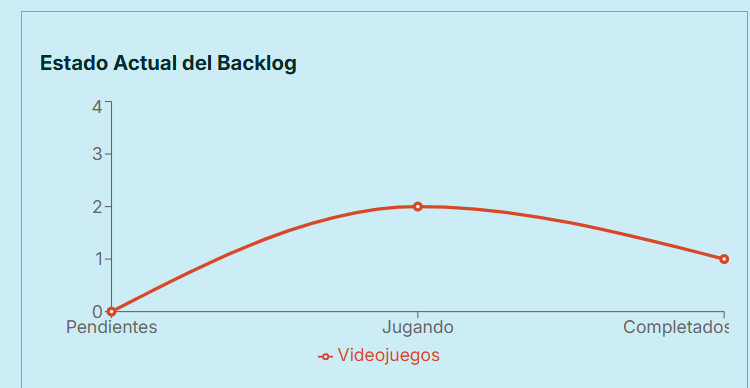

# Fase 3 - Proyecto Final de Sistemas Web

En esta entrega se encuentra mi progreso para la Fase 3 del proyecto.

## Rendimiento con React Profiler

Para comprobar las optimizaciones realicé dos pruebas grabando la actividad mientras escribía en la barra de búsqueda.

### Captura ANTES de optimizar

El renderizado tardó 30.7ms.

### Captura DESPUÉS de optimizar
Este es el resultado despues de envolver la lista filtrada y las funciones de callback:

El renderizado tardó a 28.3ms.

### Análisis de Rendimiento

* **Componentes analizados:** BarraFiltros, ListaItems, ItemCard y PanelGraficas.
* Al observar las capturas puedo observar que el tiempo de procesamiento está dominado por Recharts. 
Sin embargo la optimización se nota en los datos globales del Profiler. En la prueba antes de la optimizacion, el renderizado tomó 30.7ms. Luego de utilizar useMemo en el filtro, los handlers con useCallback y envolver la tarjeta en React.memo, el tiempo total de renderizado bajó a 28.3ms.

## Mi Gráfica Original

Hice un gráfico de líneas que muestra el Estado Actual del Backlog. El gráfico te muestra si tu backlog está siendo jugado realmente. Por ejemplo, si Pendientes está muy arriba de Completados, es necesario empezar a jugar antes de comprar más juegos.

## Mis 3 Decisiones Técnicas

- Organicé 9 acciones en `itemsReducer.js`, las que tocan los datos (`HIDRATAR`, `AGREGAR`, `ELIMINAR`, `CAMBIAR_ESTADO`), y las de la UI (`FILTRAR_CATEGORIA`, `FILTRAR_ESTADO`, `SET_BUSQUEDA`, `LIMPIAR_FILTROS`). Así el código queda limpio y fácil de cambiar.

- La acción más complicada fue `CAMBIAR_ESTADO` ya que quería mantener el reducer sin efectos secundarios. Empecé utilizando `new Date().toISOString()` dentro del reducer pero no funcionaba. La solución fue calcular la fecha en el componente y pasarla en el payload.

- La gráfica más complicada fue la de Actividad en los Últimos 7 Días, ya que era necesario convertir las fechas ISO en un formato que entienda Recharts. Hice un mapa con los 7 días, se recorren los items, se extrae la fecha de cada uno y se cuentan las interacciones por día.