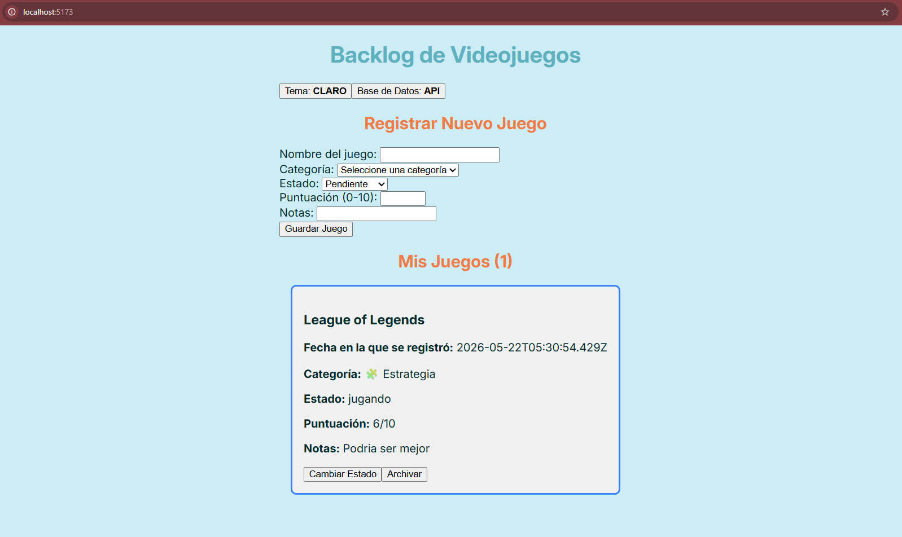
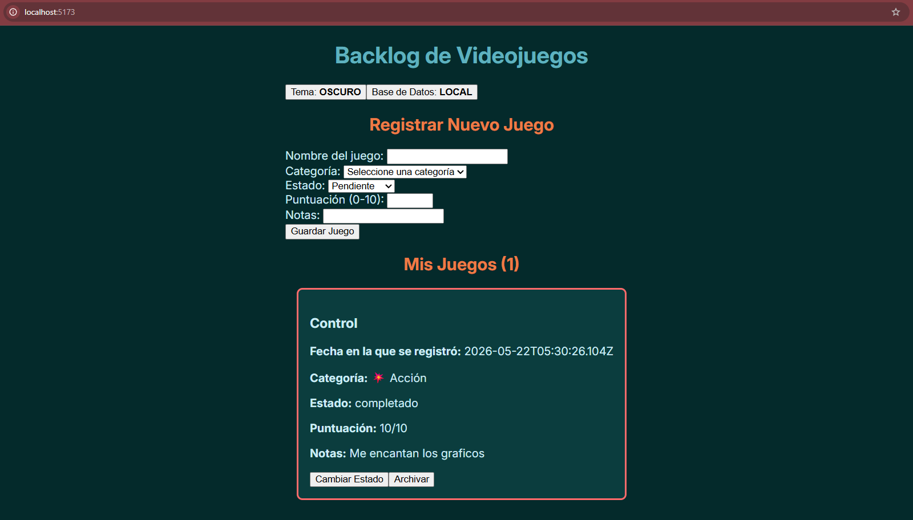

# Fase 2 - Proyecto Final de Sistemas Web

En esta entrega se encuentra mi progreso para la Fase 2 del proyecto.

## Resumen de lo implementado:

* StorageContext, context para manejar el almacenamiento tanto localmente como en la base de datos.
* ThemeContext, permite cambiar entre tema claro y oscuro. Cambia un atributo en el body y guarda la preferencia en localStorage.
* Implementé el hook useRef inputNombreRef para que al guardar un videojuego, la pagina enfoca al input del nombre.
* Implementé useRef en ultimoJuegoRef para que la lista de juegos desplace la pantalla hacia el elemento más reciente.
* Atajo teclas `Ctrl + N` o `Alt + N`: Enfoca el campo de texto del nombre del juego.
* Atajo tecla `T`: Cambia entre el tema claro y oscuro.
* Hay 5 categorías de los juegos: RPG, Acción, Estrategia, Terror y Deportes. 
Cada una cuenta con su propio id, nombre, emoji y color.

## Mi paleta de colores

### Tema Claro
* `--color-bg` (`#CDEDF6`): Fondo principal claro y suave para que la interfaz se sienta ligera.
* `--color-text` (`#042A2B`): Color de texto oscuro para buena legibilidad.
* `--color-primary` (`#5EB1BF`): Color principal de la app.
* `--color-card-bg` (`#f0f0f0`): Fondo de las tarjetas para separarlas del resto.
* `--color-accent` (`#EF7B45`): Color de énfasis para acciones importantes.
* `--color-accent-dark` (`#D84727`): Variante más fuerte para acciones como archivar.

### Tema Oscuro
* `--color-bg` (`#042A2B`): Fondo principal oscuro para ambientes con poca luz.
* `--color-text` (`#CDEDF6`): Texto claro para mantener contraste y lectura cómoda.
* `--color-primary` (`#5EB1BF`): Se mantiene igual.
* `--color-card-bg` (`#0b3d3e`): Fondo más claro que el fondo general para dar profundidad.
* `--color-accent` (`#EF7B45`): Color de énfasis que resalta sobre el fondo oscuro.
* `--color-accent-dark` (`#ff935c`): Variante más fuerte para acciones como archivar.

### Categorias

Los colores de las categorias se implementan en los bordes de las cards.

**Modo claro**

* `--categoria-rpg`: `#7C5CFC`
* `--categoria-accion`: `#E5484D`
* `--categoria-estrategia`: `#3B82F6`
* `--categoria-terror`: `#8B5CF6`
* `--categoria-deportes`: `#10B981`

**Modo oscuro**

* `--categoria-rpg`: `#9B7CFF`
* `--categoria-accion`: `#FF6B6B`
* `--categoria-estrategia`: `#60A5FA`
* `--categoria-terror`: `#A78BFA`
* `--categoria-deportes`: `#34D399`

## Screenshots de que funciona

**Modo claro y usando base de datos en la API**

**Modo oscuro y usando base de datos localmente**

